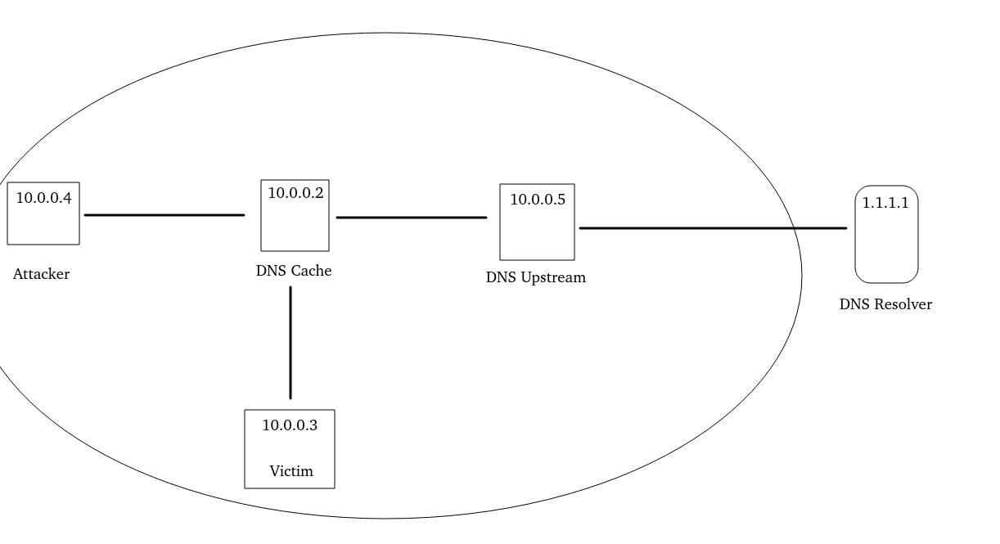
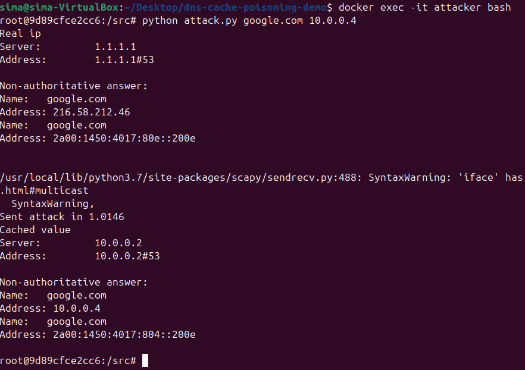
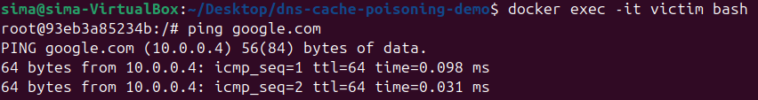
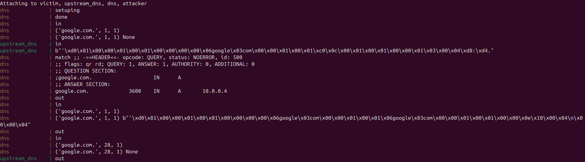

DNS Cache Poisoning Proof of Concept
===============================

PoC for a DNS Cache Poisoning Attack within an isolated network environment using docker. A mock DNS cache server forwards all request to the _upstream dns_, which in turn forwards to a real dns server and adds a 1.5 second delay.

## Quickstart

### Prerequisities

Docker and Docker Compose are needed.

### Build

```bash
docker-compose build
docker-compose up
```
Upon running, the DNS cache and upstream DNS server will start listening on port 53.

### Attack

#### 1. Into the container `attacker`

```bash
docker exec -it attacker bash
```

#### 2. Launch the attack script

```bash
python attack.py google.com 10.0.0.4
```


#### 3. Impact

As the output of the container `dns` shows, a fake DNS record has been successfully written into cache. It can be verified by using dig in the victim's container.

First get into `victim`'s container:

```bash
docker exec -it victim bash
```

In the container:

```bash
ping google.com
```



It shows that in the answer section, the record is pointing to the adversary's IP address (10.0.0.4).


## Debriefing

### Project Architecture

Four containers are used in this project:\
`DNS` (`10.0.0.2`): A vulnerable DNS cache resolver\
`Victim` (`10.0.0.3`): A victim host for proving the attack\
`Attacker` (`10.0.0.4`): The adversary who will launch the attack\
`Upstream DNS` (`10.0.0.5`): Plays the role of an upstream DNS server

### DNS Cache Server (`10.0.0.2`)

This is a mock DNS cache server. It first looks at the cache stored and returns the cache if there is. Otherwise, it will forward the request to the upstream DNS server, waiting for responses.

The operating conditions were simplifed to enuntiate the attack by restrincting the Query ID (QID) for requests to a range of 10000 to 10500, and fixing the source port to 22222 to avoid launching a birthday attack, which is not the goal of this project.

Once received the response, it will validate if two QIDs match and then send the answer to the client.

### Upstream DNS (`10.0.0.5`)

Forwards all requests to `1.1.1.1` and waits 1.5 seconds before returning the response

### Attacker (`10.0.0.4`)

The adversary first sends a DNS query to the DNS cache server (`10.0.0.2`), so the server will send a DNS request to the upstream server and begin accepting responses. Then it sends DNS answers trying all possible QID from the destination impersonating the upstream server (`10.0.0.5`) to the cache server (`10.0.0.2`).

An attack script (`/attacker/attack.py`) is thereby created.

#### Usage:
```bash
python attack.py [target domain] [spoofed IP]
```
